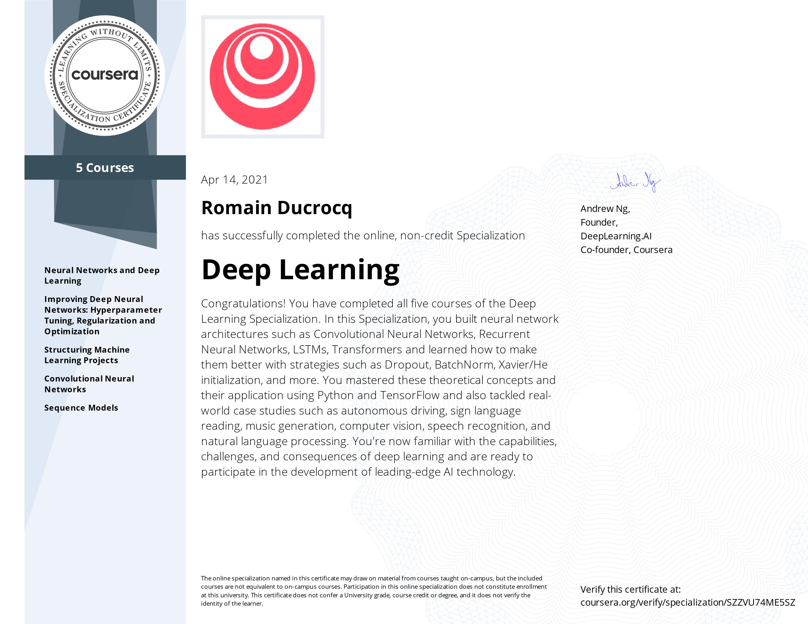

# DEEP LEARNING SPECIALIZATION
## Andrew Ng, deeplearning.ia, Coursera

****

### Certificate



****

### Syllabus

<h2>  

```diff  
+ Course 1: Neural Networks and Deep Learning
```

</h2>  

**Week 1**
- Lecture 1: Introduction to Deep Learning

**Week 2**
- Lecture 2: Logistic Regression as a Neural Network
- Lecture 3: Python and Vectorization
- Lab 1: Python Basics With Numpy
- Assignment 1: Logistic Regression with a Neural Network mindset

**Week 3**
- Lecture 4: Shallow neural networks
- Assignment 2: Planar data classification with one hidden layer

**Week 4**
- Lecture 5: Deep Neural Network
- Assignment 3: Building your Deep Neural Network Step by Step
- Assignment 4: Deep Neural Network Application

<h2>  

```diff  
+ Course 2: Improving Deep Neural Networks: Hyperparameter Tuning, Regularization and Optimization
```

</h2>  

**Week 5**
- Lecture 6: Setting up your Machine Learning Application
- Lecture 7: Regularizing your neural network
- Lecture 8: Setting up your optimization problem
- Assignment 5: Initialization
- Assignment 6: Regularization
- Assignment 7: Gradient Checking

**Week 6**
- Lecture 9: Optimization algorithms
- Assignment 8: Optimization

**Week 7**
- Lecture 10: Hyperparameter tuning
- Lecture 11: Batch Normalization
- Lecture 12: Multiclass classification
- Lecture 13: Introduction to programming frameworks
- Assignment 9: Tensorflow

<h2>  

```diff  
+ Course 3: Structuring Machine Learning Projects
```

</h2>  

**Week 8**
- Lecture 14: Introduction to ML Strategy
- Lecture 15: Setting up your goal
- Lecture 16: Comparing to human level performance

**Week 9**
- Lecture 17: Error Analysis
- Lecture 18: Mismatched training and dev test set
- Lecture 19: Learning from multiple tasks
- Lecture 20: End to end deep learning

<h2>  

```diff  
+ Course 4: Convolutional Neural Networks
```

</h2>  

**Week 10**
- Lecture 21: Convolutional Neural Networks
- Assignment 10: Convolutional Model step by step
- Assignment 11: Convolutional Model application

**Week 11**
- Lecture 22: Case studies
- Lecture 23: Practical advices for using ConvNets
- Lab 2: Keras Tutorial
- Assignment 12: Residual Networks

**Week 12**
- Lecture 24: Detection algorithms
- Assignment 13: Car detection with YOLO

**Week 13**
- Lecture 25: Face Recognition
- Lecture 26: Neural Style Transfer
- Assignment 14: Art generation with Neural Style Transfer
- Assignment 15: Face Recognition

<h2>  

```diff  
+ Course 5: Sequence Models
```

</h2>  

**Week 14**
- Lecture 27: Recurrent Neural Networks
- Assignment 16: Building a recurrent neural network step by step
- Assignment 17: Dinosaur Island, Character Level Language Modeling
- Assignment 18: Jazz improvisation with LSTM

**Week 15**
- Lecture 28: Introduction to Word Embeddings
- Lecture 29: Learning Word Embeddings Word2vec and GloVe
- Lecture 30: Applications using Word Embeddings
- Assignment 19: Operations on word vectors, Debiasing
- Assignment 20: Emojify

**Week 16**
- Lecture 31: Various sequence to sequence architectures
- Lecture 32: Speech recognition, Audio data, Conclusion
- Assignment 21: Neural Machine Translation with Attention
- Assignment 22: Trigger word detection

