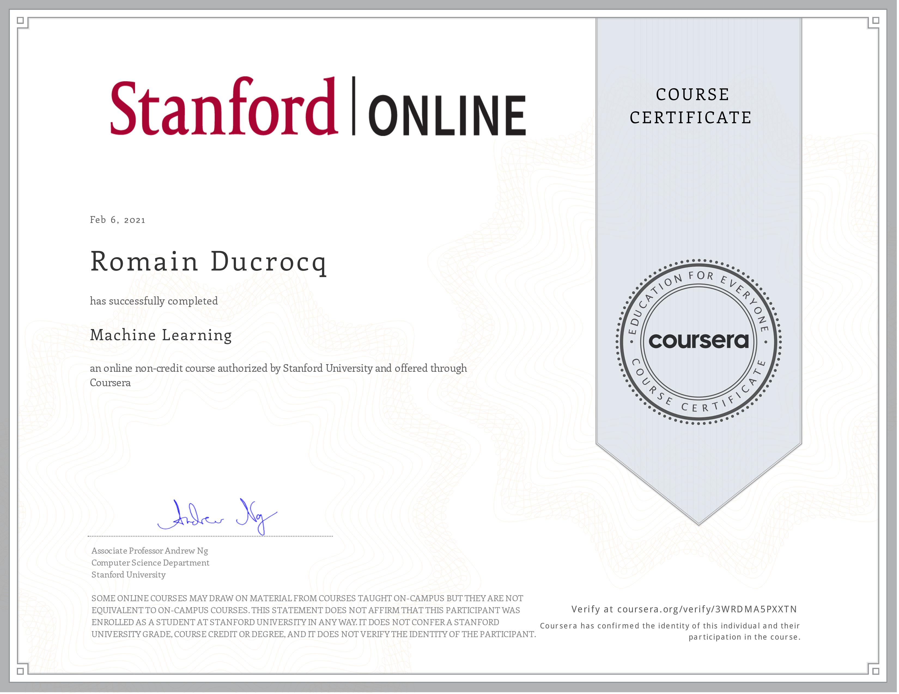

# MACHINE LEARNING
## Andrew Ng, Stanford University, Coursera

****

### Certificate

****

### Syllabus

**Week 1**
- Lecture 1: Introduction
- Lecture 2: Linear Regression With One Variable
- Lecture 3: Linear Algebra Review

**Week 2**
- Lecture 4: Linear Regression With Multiple Variables
- Lecture 5: Octave Tutorial
- Assignment 1: Linear Regression

**Week 3**
- Lecture 6: Logistic Regression
- Lecture 7: Regularization
- Assignment 2: Logistic Regression

**Week 4**
- Lecture 8: Neural Networks Representation
- Assignment 3: Multi-Class Classification And Neural Networks

**Week 5**
- Lecture 9: Neural Networks Learning
- Assignment 4: Neural Network Learning

**Week 6**
- Lecture 10: Advice For Applying Machine Learning
- Lecture 11: Machine Learning System Design
- Assignment 5: Regularized Linear Regression And Bias-Variance

**Week 7**
- Lecture 12: Support Vector Machines
- Assignment 6: Support Vector Machines

**Week 8**
- Lecture 13: Clustering
- Lecture 14: Dimensionality Reduction
- Assignment 7: K-Means Clustering And PCA

**Week 9**
- Lecture 15: Anomaly Detection
- Lecture 16: Recommender Systems
- Assignment 8: Anomaly Detection And Recommender Systems

**Week 10**
- Lecture 17: Large Scale Machine Learning

**Week 11**
- Lecture 18: Application Example Photo OCR
